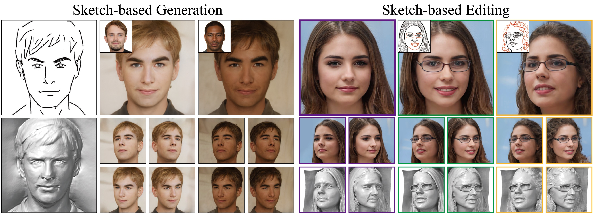

# SketchFaceNeRF: Sketch-based Facial Generation and Editing in Neural Radiance Field<br><sub>Official implementation</sub>



## Abstract
Realistic 3D facial generation based on Neural Radiance Fields (NeRFs) from 2D sketches benefits various applications.
	Despite the high realism of free-view rendering results of NeRFs, it is tedious and difficult for artists to achieve detailed 3D control and manipulation.
	Meanwhile, due to its conciseness and expressiveness, sketching has been widely used for 2D facial image generation and editing.
	Applying sketching to NeRFs is challenging due to the inherent uncertainty for 3D generation with 2D constraints, a significant gap in content richness when generating faces from sparse sketches, and potential inconsistencies for sequential multi-view editing given only 2D sketch inputs.
	To address these challenges, we present SketchFaceNeRF, a novel sketch-based 3D facial NeRF generation and editing method, to produce free-view photo-realistic images. 
	To solve the challenge of sketch sparsity, we introduce a Sketch Tri-plane Prediction net to first inject the appearance into sketches, thus generating features given reference images to allow color and texture control. 
	Such features are then lifted into compact 3D tri-planes to supplement the absent 3D information, which is important for improving robustness and faithfulness.
	However, during editing, consistency for unseen or unedited 3D regions is difficult to maintain due to limited spatial hints in sketches.
	We thus adopt a Mask Fusion module to transform free-view 2D masks (inferred from sketch editing operations) into the tri-plane space as 3D masks, which guide the fusion of the original and sketch-based generated faces to synthesize edited faces. 
	We further design an optimization approach with a novel space loss to improve identity retention and editing faithfulness. 
	Our pipeline enables users to flexibly manipulate faces from different viewpoints in 3D space, easily designing desirable facial models. 
	Extensive experiments validate that our approach is superior to the state-of-the-art 2D sketch-based image generation and editing approaches in realism and faithfulness. 

## Requirements

* We have done all training, testing and development using V100 GPUs on the Linux platform.
* CUDA toolkit 11.3 or later. (Why is a separate CUDA toolkit installation required?  We use the custom CUDA extensions from the StyleGAN3 repo. Please see [Troubleshooting](https://github.com/NVlabs/stylegan3/blob/main/docs/troubleshooting.md#why-is-cuda-toolkit-installation-necessary)).
* Python libraries: see [environment.yml](./environment.yml) for exact library dependencies. You can use the following commands with Miniconda3 to create and activate your Python environment:
  - `conda env create -f environment.yml`
  - `conda activate skNerf`

## Getting started

- Please download the pretrained models following the [link](https://drive.google.com/drive/folders/1db_gLfHXNyU5lM03JeSVzy4YPWwGK6La?usp=sharing) and put them under `./checkpoints`. 
- Additionally, please:
  - Go to the [link](https://nvlabs-fi-cdn.nvidia.com/stylegan2-ada-pytorch/pretrained/metrics/vgg16.pt) to download the` vgg16.pt` and put it under `./checkpoints`. 
  - Go to the [link](https://drive.google.com/file/d/154JgKpzCPW82qINcVieuPH3fZ2e0P812/view) to download `79999_iter.pth`, and put it under `./parsing_model/checkpoint/`.
  - Go to the [link](https://github.com/sicxu/Deep3DFaceRecon_pytorch/tree/master) to download its `BFM` directory, follow the `Prepare prerequisite models` section (we set 'model_name' as 'pretrained' ).

## Evaluation

- Generate 3D faces from hand-drawn sketches:

  ```
  python inference_handdraw.py
  ```

- Generate random 3D faces and edit facial components:

  ```
  ./edit_face.sh
  ```

## Training

Coming soon

## Citation
```
@article {SketchFaceNeRF2023,
    author = {Gao, Lin and Liu, Feng-Lin and Chen, Shu-Yu and Jiang, Kaiwen and Li, Chun-Peng and Lai, Yu-Kun and Fu, Hongbo},
    title = {SketchFaceNeRF: Sketch-Based Facial Generation and Editing in Neural Radiance Fields},
    journal = {ACM Transactions on Graphics (Proceedings of ACM SIGGRAPH 2023)},
    year = {2023},
    volume = 42,
    pages = {159:1--159:17},
    number = 4
}
```

## Acknowledgements
This repository relies on the [EG3D](https://github.com/NVlabs/eg3d), [Deep3DRecon](https://github.com/sicxu/Deep3DFaceRecon_pytorch), [pSp](https://github.com/eladrich/pixel2style2pixel), [face-parsing.PyTorch](https://github.com/zllrunning/face-parsing.PyTorch/tree/master), [pixel_nerf](https://github.com/sxyu/pixel-nerf).

